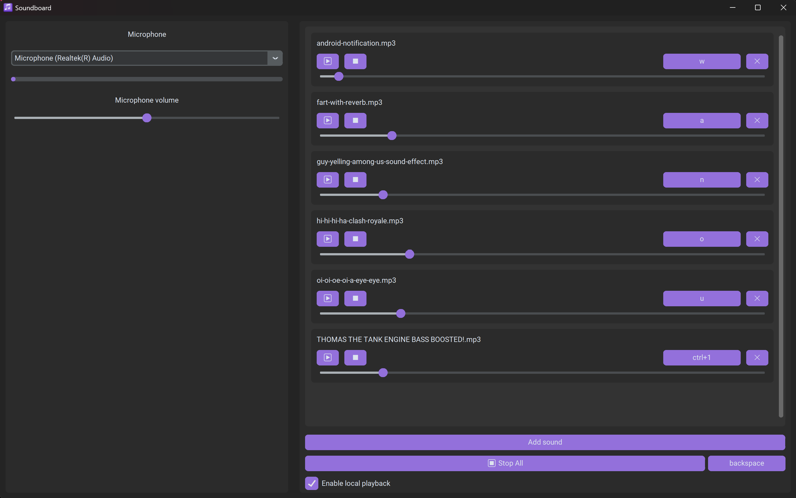

# Keyboard soundBoard


<div align=center>
  
  
  
  <p></p>
  <p> Make your keyboard a soundboard </p>
</div>

A desktop soundboard built with CustomTkinter.

SoundBoard allows you to play sounds using customizable keyboard shortcuts and send them directly through your microphone using VB-Cable. It includes real-time microphone mixing, per-sound volume control, and global hotkeys, making it useful for gaming, streaming, online meetings, or simply having fun with friends.



## Supported Operating Systems

### Windows

Fully supported and tested.

Requirements :

- Python 3.11+ (for development) 
- VB-Cable

### Linux

Experimental support.

The graphical interface should work, but audio routing through VB-Cable is not available on Linux. Additional work would be required to support PipeWire or PulseAudio virtual devices.

### macOS

Currently unsupported and untested.

## Installation
> [!IMPORTANT]
> If you only want to use the software, download the executable in the release and follow the `Using VB-Cable` section.

Else, if you want to develop this software you need to:

1 - Clone the repository: 

```bash
git clone https://github.com/Wanous/Keyboard-soundboard.git

cd Keyboard-soundboard
```

2 - Install dependencies:

```bash
pip install -r requirements.txt
```

3 - Run the application:

```bash
python main.py
```

## Using VB-Cable

1. Install VB-Cable.
2. Launch SoundBoard.
3. Select your microphone.
4. In Discord (or another application), choose:

```text
CABLE Output (VB-Audio Virtual Cable)
```

as your microphone device.

5. Play sounds using the interface or keyboard shortcuts.

The application will automatically mix:

```text
Microphone + Soundboard
```

and send the result through VB-Cable.

## Features

### Audio Mixing

- Real-time microphone capture.
- Real-time soundboard audio injection.
- Audio mixing between microphone and soundboard.
- VB-Cable integration.
- Compatible with Discord, Teams, Zoom, and other voice applications.

### Sound Management

- Add sounds from audio files.
- Remove sounds.
- Play and stop sounds individually.
- Stop all sounds instantly.
- Per-sound volume control.
- Local playback monitoring (hear sounds yourself).

### Hotkeys

- Custom keyboard shortcut for each sound.
- Global "Stop All" shortcut.
- Hotkeys work even when the application is not focused.

### Microphone Controls

- Microphone selection.
- Real-time microphone level indicator.
- Microphone volume adjustment.

### Configuration

The application automatically saves:

- Sound shortcuts.
- Sound volumes.
- Selected microphone.
- Microphone volume.
- Local playback state.
- Stop All shortcut.

## Configuration File

Settings are stored `%APPDATA%/SoundBoard`:

```text
config/config.json
```

Example:

```json
{
    "parameters": {
        "local_playback_enabled": true,
        "microphone_volume": 1.0,
        "default_microphone": 5,
        "panic_shortcut": "backspace"
    },

    "sound_datas": {
        "kick.wav": {
            "shortcut": "ctrl+1",
            "volume": 0.75
        },

        "snare.mp3": {
            "shortcut": "ctrl+2",
            "volume": 1.0
        }
    }
}
```

## Conclusion

I'm pretty satisfied and happy with the result, so I will probably stop developing this project. Hope you will like it and if you have recommendations or critics I'm will be happy to hear them :3
